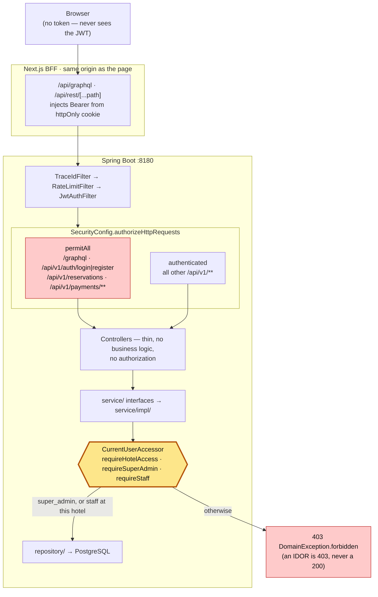

# ARCHITECTURE (as implemented)

> Everything below was read out of source, config or the running system.
> Where the repo's own docs disagree, the disagreement is recorded explicitly.

## 1. Shape

**Layered monolith. One deployable backend, one database, two Next.js clients.**

```
┌─────────────────────┐        ┌──────────────────────┐
│  frontend-hotel     │        │  backoffice-hotel    │
│  Next 16 :3000      │        │  Next 16 :3101       │
│  Apollo (reads)     │        │  Apollo (reads)      │
│  Axios (writes)     │        │  Axios + TanStack    │
│  guests, public     │        │  staff, auth-walled  │
└──────────┬──────────┘        └──────────┬───────────┘
           │ /api/graphql (BFF proxy)     │ /api/graphql (BFF proxy)
           │ /api/rest/...  (BFF proxy)   │ /api/rest/...  (BFF proxy)
           │ /api/auth/*    (BFF)         │ /api/auth/*   (BFF, httpOnly)
           └───────────────┬──────────────┘
                           ▼
              ┌────────────────────────────┐
              │  backend-hotel :8180       │
              │  Spring Boot 4 / Java 21   │
              │  GraphQL (READ ONLY)       │
              │  + REST writes /api/v1     │
              └────┬──────────────────┬────┘
                   │ JPA              │ INSERT event_outbox (same tx)
                   ▼                  ▼
          ┌──────────────┐    ┌──────────────────┐
          │ PostgreSQL16 │    │  OutboxRelay     │ @Scheduled 1s
          │ 54 tables    │    │  claim→publish   │
          └──────────────┘    └────────┬─────────┘
                                       ▼
                              ┌──────────────────┐
                              │ Kafka (KRaft)    │  ⚠ NO CONSUMERS
                              └──────────────────┘
```

## 2. Backend internal structure

`com.hotelcollection.hotel` — **257 Java files**, flat layer packages:

| Package | Responsibility | Gate |
|---|---|---|
| `controller/` | 11 GraphQL `@Controller` + 6 REST `@RestController`. Thin. | must not touch `repository/` or `service/impl/` |
| `service/` | 28 use-case **interfaces** — the only legal cross-domain seam | — |
| `service/impl/` | 29 implementations: domain logic, orchestration, authorization, transactions | ≤ 11 constructor deps |
| `repository/` | 36 Spring Data JPA repositories | reachable only from `service/..` |
| `entity/` | 55 JPA entity/enum types, mirror the Flyway schema 1:1 | `ddl-auto: validate` fails the app on drift |
| `dto/<domain>/` | 66 GraphQL/REST input & view **records**, grouped into 13 domain packages | — |
| `security/` | `SecurityConfig`, `JwtService`, `JwtAuthFilter`, `RateLimitFilter`, `TraceIdFilter`, `CurrentUser(Accessor)` | — |
| `config/`, `exception/`, `mapper/`, `util/`, `storage/` | cross-cutting | — |

Enforced by `src/test/java/.../architecture/ModuleArchitectureTest.java` (**5** ArchUnit
rules, not 7 as `backend-hotel/AGENTS.md` claims):

 1. `NO_LEGACY_HEXAGONAL_PACKAGES` — bans `..api..`, `..application..`, `..domain..`, `..adapter..`
 2. `IMPLEMENTATIONS_ARE_ONLY_ACCESSED_FROM_SERVICES`
 3. `REPOSITORIES_ARE_ONLY_ACCESSED_FROM_SERVICES`
 4. `CONTROLLERS_DELEGATE_TO_SERVICES`
 5. `SERVICES_ARE_NOT_GOD_CLASSES` (≤ 11 ctor deps)

All five are green as of the canonical single-hotel task (rules 3–4 were red until
`StaySearchGraphQLController` moved `findAllActive()` behind `CatalogQueryService.canonicalHotel()`).

> **Documented vs implemented — the biggest trap in this repo.**
> `backend-hotel/docs/architecture/architecture.md`, `ADR-008-modular-monolith.md` and
> `backend-hotel/AGENTS.md` all describe a *hexagonal modular monolith* with per-domain
> `admin/ audit/ availability/ …` packages each containing `api/application/domain/adapter`.
> **That layout does not exist and rule 1 forbids it.** The untracked
> `ADR-009-layered-architecture.md` (in the working tree) is the accurate description.

## 3. API surface

### GraphQL — READ ONLY (`POST /graphql`, GraphiQL at `/graphiql` in `dev` only)

Schema is **split per domain** under `src/main/resources/graphql/<domain>/*.graphqls`.
`schema.graphqls` at the root is only a skeleton: `schema { … }`, the `LocalDate` /
`DateTime` scalars and the empty `type Query` that every module `extend`s.
**There is no Mutation root.** (API rule: GraphQL = READ, REST = WRITE/ACTION —
enforced by the `NO_GRAPHQL_MUTATIONS` ArchUnit rule. See
[API_GUIDELINES.md](API_GUIDELINES.md).)

| Domain | Queries |
|---|---|
| catalog | `hotels · canonicalHotel · hotel · hotelDetails · roomType · roomTypes · experiences · restaurants · extras · faqs · adminHotel · adminHotels · adminAmenities` |
| homepage | `homepage` |
| availability | `availability · staySearch` |
| rate | `offers · rates · quote · adminPromotions` |
| reservation | `myReservations · reservation · adminReservations · adminGuests` |
| billing | `adminPayments · adminInvoices` |
| identity | `me · adminUsers · adminRoles` |
| review | `reviews · adminReviews` |
| platform / notification / audit / admin | `platform · adminNotifications · adminAuditLogs · adminDashboard` |

### REST — the only write path (`/api/v1/**`, uniform `ApiError` envelope)

| Route | Auth | Purpose |
|---|---|---|
| `POST /api/v1/auth/{login,register}` | public (rate-limited) | token bootstrap |
| `POST /api/v1/auth/me/profile` | authenticated | self profile update |
| `POST /api/v1/reservations`, `…/{ref}/cancel`, `…/{ref}/invoice` | public | anonymous reference+email self-service (create requires `Idempotency-Key` header) |
| `POST /api/v1/payments`, `…/{id}/capture` | authenticated | — |
| `POST /api/v1/hotels/{hotelId}/reviews` | authenticated | guest review creation |
| `POST /api/v1/media/upload`, `DELETE /api/v1/media/{id}` | authenticated | multipart |
| `/api/v1/admin/**` | authenticated | back-office writes: hotel/room-type/room CRUD + associations (`PUT …/amenities|media|policies`), rate plans (`…/rate-plans`, `…/room-type-rate-plans` + `…/{linkId}/prices`), promotions (`…/promotions`, `…/{id}/status`), availability (`PUT /api/v1/admin/availability/hotels/{hotelId}`), reservations (`…/admin/reservations/{id}/cancel`), reviews (`…/admin/reviews/{id}/moderation`), users & roles (`…/admin/users`, `…/users/{id}/roles`) |
| `GET /actuator/{health,info,prometheus}` | public | ops |
| `GET /media/**` | public | stored bytes (static resource handler) |

Uniform error envelope (`ApiError`) with codes `NOT_FOUND · FORBIDDEN · CONFLICT ·
VALIDATION · UNAUTHORIZED`, emitted from both the REST advice
(`GlobalExceptionHandler`) and the GraphQL advice (`GraphqlExceptionHandler`), and even
from filter-level 401/403/429 via `ErrorResponseWriter`.

## 4. Security boundaries

### Where a request is actually authorized

The single most important thing to understand about this backend: **the filter chain does
not authorize admin reads.** `/graphql` is one `permitAll` URL, so the check happens
further in, inside the service. Read this diagram before adding any admin endpoint.



**The yellow box is the real security boundary.** Everything above it is reachable by an
anonymous caller.

- **Stateless.** `SessionCreationPolicy.STATELESS`, CSRF disabled, bearer-token only.
- **`/graphql` is `permitAll` at the filter chain.** Authorization is enforced *inside*
  application services via `CurrentUserAccessor.requireHotelAccess(hotelId)` (or
  `requireSuperAdmin()` / `requireStaff()`) — an IDOR yields `403`, not `200`. This is
  deliberate and documented in `SecurityConfig`.
  **This is enforced by the build, not by convention:** the ArchUnit rule
  `ADMIN_GRAPHQL_READS_ARE_AUTHORIZED` follows every `@QueryMapping` on
  `AdminGraphQLController` into its service interface, on to the implementation, and
  through that implementation's private helpers. A resolver whose service never reaches a
  `CurrentUserAccessor` call **fails `mvn test`**.
- **JWT**: HS256, claims `sub · email · roles · hotels · type=access`, TTL from
  `JWT_TTL_MINUTES` (60). `JwtService` refuses to construct if `JWT_SECRET` is missing,
  `< 32 bytes`, or equals the historic in-repo default → the app fails fast at startup.
- **Passwords**: BCrypt strength 12.
- **Rate limiting**: `RateLimitFilter` covers the whole *anonymous* surface, per client IP
  and per policy (a burst on one endpoint cannot consume another's budget):
  auth login/register 20/min, `/api/v1/reservations` **5/min**, `/api/v1/payments` 10/min.
  The reservation budget is the tight one on purpose — every create sells a physical room
  unit and holds it for `app.reservations.hold-minutes`, so an unthrottled endpoint let a
  script deny the property's entire inventory. Trips are logged at `WARN`.
- **Payments are simulated.** `app.payments.auto-settle-enabled` defaults to `false` and
  the application **refuses to start with it enabled under the `prod` profile**
  (`config/PaymentSafetyConfig`) — it would otherwise confirm reservations with no money
  movement. The webhook fails closed on a blank secret and compares in constant time.
- **GraphQL cost is bounded** for anonymous callers: depth ≤ 15 and complexity ≤ 1000
  (`config/GraphqlConfig`). Introspection and GraphiQL are off outside `dev`.
- **RBAC is role-name based.** The `permissions` / `role_permissions` tables exist and
  are **empty**, and the `Permission` entity has **no repository and no usages** — dead.
- **CORS**: origins from `CORS_ALLOWED_ORIGINS` (default `*`; the prod overlay requires it
  to be set explicitly); headers `Authorization`, `Content-Type`, `Idempotency-Key`;
  credentials never allowed.

### The two clients authenticate the same way (BFF + httpOnly cookie)

| | frontend-hotel (guest) | backoffice-hotel (staff) |
|---|---|---|
| Login call | BFF `POST /api/auth/login` → REST `POST :8180/api/v1/auth/login` | BFF `POST /api/auth/login` → REST `POST :8180/api/v1/auth/login` |
| Token storage | **httpOnly `guest_session` cookie** (30 d) | httpOnly `bo_session` cookie (7 d) |
| Survives refresh | Yes | Yes |
| Token reaches browser | No | No |
| Sends token | `/api/graphql` + `/api/rest` BFF proxies inject it server-side | same |

Auth itself is a REST write (API rule) — there are no GraphQL auth mutations.

## 5. Eventing — outbox, Kafka, and (since 2026-09-03) a real consumer

Textbook transactional outbox, correctly built:

- `OutboxEventPublisher` (`@Transactional(MANDATORY)`) writes `event_outbox` in the
  *same* transaction as the business change — an event can never exist without its fact.
- `OutboxRelay` (`@Scheduled fixedDelay=${app.outbox.relay-interval-ms:1000}`) claims a
  batch in its **own** transaction (`pending → publishing`, `attempts+1`) and **commits
  before** publishing, so Kafka I/O never runs inside a DB transaction; a second
  transaction records the outcome. `releaseStaleClaims` (30 s, 5-min window) recovers
  crashes; `maxAttempts` (5) bounds retries.
- `KafkaOutboxPublisher` sends synchronously with a 10 s `get()` per envelope.
- Topic = `hotelcollection.<eventType>.v<version>`.

**Event types published (verified against `eventPublisher.publish` call sites
2026-09-03): `booking.created`, `booking.confirmed`, `booking.cancelled`,
`payment.created`, `payment.captured`, `payment.failed`, `payment.refunded`,
`user.registered`.**
`booking.created` fires when the reservation is taken as a *payment hold*;
`booking.confirmed` fires from `BookingServiceImpl#onReservationConfirmed` — a single
method now called from both the pay-at-property path (`create`, immediately) and the
payment-capture path (`markFullyPaid`), closing a prior gap where only the latter
actually published the event. `user.registered` is platform-wide (`hotelId` null),
published from `AuthServiceImpl#register`.

**`EmailEventConsumer` (`service/impl/`) is the first `@KafkaListener` in this
repository.** It subscribes to `booking.confirmed`, `booking.cancelled`,
`payment.refunded`, `payment.failed` and `user.registered`, and turns each into one or
more emails via `NotificationService` → `EmailProviderFactory` → an `EmailProvider`
(`SimulatedEmailProvider` by default; `SmtpEmailProvider` — a provider-neutral SMTP
adapter, pointed at Gmail's relay via config only, never a compile-time Gmail
dependency — when `app.email.provider=smtp`). See §5a.

Kafka remains a **hard startup dependency** of the backend container
(`depends_on: kafka: service_healthy`) — now for a real reason, not just the producer.

### 5a. Email notification pipeline

```
business service ──eventPublisher.publish──► event_outbox (same tx)
                                                    │
                                          OutboxRelay (1s poll)
                                                    ▼
                                    hotelcollection.<type>.v1 (Kafka)
                                                    │
                                          EmailEventConsumer
                                    (routes event type → NotificationService method(s))
                                                    ▼
                                          NotificationServiceImpl
                    ┌── event_consumption idempotency guard (per email type) ──┐
                    │  render templates/email/*.html (Thymeleaf)               │
                    │  attach invoice/credit-note PDF when applicable          │
                    │  (InvoiceService — reused, never regenerated here)       │
                    └──────────────────────────┬──────────────────────────────┘
                                                ▼
                                    EmailProviderFactory.resolve()
                                                ▼
                        EmailProvider  (SimulatedEmailProvider | SmtpEmailProvider)
                                                ▼
                                    notifications row (sent/failed)
```

- **Idempotency:** `event_consumption` (schema since V8, unwritten until now) — one row
  per `(consumerGroup, eventId)`, `consumerGroup` scoped per email type
  (`"email:booking_confirmation"`, `"email:invoice"`, …) so one event's several emails
  are tracked, retried and deduplicated independently. Checked before work, recorded
  after a successful send, in the same transaction as the `notifications` row.
- **Retry/DLQ:** `KafkaConsumerConfig` — a thrown exception (transport failure) retries
  with exponential backoff (~15s total), then the record is published to
  `<topic>.DLT` and the offset commits so one poison message can't block the partition.
  `DomainException` (a deterministic business outcome) skips retries and goes straight
  to the DLT.
- **Business services never call `NotificationService` directly** — only
  `EventPublisher.publish(...)`. An email provider's latency or failure can therefore
  never affect a booking/payment/registration transaction. See `NotificationService`'s
  class javadoc.
- **No OTP/email-verification flow exists anywhere in this codebase** — nothing to wire
  delivery to. `templates/email/otp.html` + `OtpEmailData` exist, themed and ready, but
  no `NotificationService` method or event type calls them — building the OTP
  generation/validation/rate-limiting logic itself is a distinct authentication feature,
  out of scope here.

### 5b. Email presentation — theme, data records, fragments

Every template receives exactly two top-level Thymeleaf variables, never a grab-bag of
loose values:

```
EmailTheme (colors, fonts, hotel name/logo, footer contact)
        +
<Type>EmailData (already-formatted, email-specific content — no arithmetic
                  or date/money formatting happens in a template)
        |
        v
   templates/email/<name>.html
        │  th:replace's shared header/footer/button fragments from
        │  templates/email/fragments/layout.html — one visual identity,
        │  one place to change it
        v
   final HTML (table-based, inline-styled — bulletproof email markup,
               not the app's Tailwind classes)
```

- **`EmailTheme`** (`dto/email/`) — colors/fonts are fixed constants (mirroring
  `frontend-hotel`'s actual navy/gold/paper palette, `src/app/globals.css` `@theme`
  block, so the emails read as the same product as the guest site); hotel
  name/logo/address/phone/email are real data, resolved once per send in
  `NotificationServiceImpl`:
  - Hotel-scoped emails (confirmation/invoice/cancellation/refund/payment-failed):
    `EmailTheme.forHotel(...)` from `CatalogQueryService.getHotel(reservation.getHotelId())`.
  - The welcome email (platform-wide, no `hotelId`): tries
    `CatalogQueryService.canonicalHotel()` for the branded result, but — since that
    call enforces a production invariant (exactly one active hotel) this email has no
    business depending on — catches any failure and falls back to a generic
    `EmailTheme.forPlatform(...)` rather than letting a welcome email retry/dead-letter
    over it.
  - **Logo** resolution: `MediaRepository` — hotel-scoped `media` row
    (`category='logo'`) first, then platform-scoped (matches the actual seed data,
    where the logo is a platform-level asset), then no logo at all — the header
    fragment renders a text-only mark rather than a broken image in that case.
- **`<Type>EmailData` records** (`dto/email/` — `WelcomeEmailData`,
  `BookingConfirmationEmailData`, `InvoiceEmailData`, `CancellationEmailData`,
  `RefundEmailData`, `PaymentFailedEmailData`, `OtpEmailData`) — the same
  "authoritative backend data in, presentation-only template out" split
  `DocumentGenerationServiceImpl` already uses for invoice PDFs (`InvoiceDocumentData`).
- **Email-safe HTML**: `role="presentation"` tables (not divs), inline styles on every
  element (no external/`<style>`-block dependency for anything that must render —
  the one `<style>` block per template is a `@media (max-width:620px)` progressive
  enhancement only), a bulletproof table+td button pattern, HTML entities for
  typographic characters (`&#8594;`, `&#183;`, `&#10003;`) instead of relying on a
  specific charset beyond the declared UTF-8. Deliberately *not* the app's Tailwind
  classes — email clients (Outlook desktop especially) don't run a CSS framework.
- **Preview/testing**: `EmailTemplatePreviewTest` (`src/test/java/.../email/`) renders
  every template with realistic + edge-case data (long names, missing optional fields,
  different currencies, an HTML-injection escaping proof) with a bare
  `SpringTemplateEngine` — no Spring context, no send — and writes the output to
  `target/email-previews/*.html` for a developer to open directly. Not a production
  endpoint.

## 6. Frontend architectures

### frontend-hotel (guest)
- App Router, mostly **Server Components** for shell/metadata + client components for
  interactive flows. `output: 'standalone'`.
- **Data clients** (see [API_GUIDELINES.md](API_GUIDELINES.md)): Apollo Client for
  browser reads (`src/api/apollo/`), Axios for writes through the `/api/rest` BFF
  proxy (`src/api/rest/`), an invalidation registry mapping REST writes → Apollo
  queries (`src/api/invalidation.ts`), and typed read hooks
  (`src/api/graphql/hooks.ts`). **No React Query.**
- Browser → same-origin `/api/graphql` (BFF route handler; injects the httpOnly
  cookie's Bearer) and `/api/rest/...` (write proxy). Server components fetch the
  backend directly via `src/services/graphqlClient.ts` (stateless, shared typed
  documents).
- Auth: same-origin `/api/auth/*` route handlers; the backend JWT lives only in the
  httpOnly `guest_session` cookie.
- Contexts: `SearchContext` (stay params, URL-driven), `SessionContext`, `ToastContext`,
  `ModalContext`. Rule from the codebase: **the URL is the state** for search params.
- Strict CSP + security headers set in `next.config.ts`.

### backoffice-hotel (staff)
- A genuine **BFF**: every backend call is proxied through
  `src/app/api/graphql/route.ts` (reads) and `src/app/api/rest/[...path]/route.ts`
  (writes), which read the httpOnly cookie and inject the bearer. The browser never
  sees the token and never learns the backend URL (`HOTEL_API_URL`).
- **Data clients**: Apollo Client owns all GraphQL reads (13 pages + hotel workspace
  tabs, via `useQuery` from `@apollo/client/react`); Axios (`src/api/rest/`) owns all
  REST writes; `@tanstack/react-query` handles **mutation lifecycle only**
  (`useMutation` wrapping the Axios calls) and caches no read data. After a write,
  `invalidateAfterWrite` (src/api/invalidation.ts) evicts the affected Apollo
  queries and the legacy RQ keys.
- Route groups `(auth)/login` and `(backoffice)/*` (14 pages, all real GraphQL reads).
- Media: real file upload via `POST /api/v1/media/upload` (REST, multipart through the
  BFF proxy) in the hotel overview tab.

## 7. Infrastructure

- `docker-compose.yml` (base, prod-shaped images) + `.dev.yml` (bind mounts, `mvnw
  spring-boot:run` / `npm run dev`) + `.prod.yml` (ports unbound, log rotation, requires
  explicit `CORS_ALLOWED_ORIGINS`). Selected mode persisted in `.docker-mode`.
- Named volumes `postgres_data`, `kafka_data`, `media_data`. `clean.sh` never removes
  volumes unless `--all`.
- Healthchecks on all five services; backend gates on Postgres **and** Kafka.
- **No CI/CD pipeline, no Kubernetes manifests, no Terraform, no cloud provider config
  exists in this repository.** Quality gates run only via `scripts/test.sh` / `make test`.

## 8. Business model — single-hotel canonical platform

**The platform operates exactly ONE hotel.** Migration `V26__canonical_single_hotel.sql`
deactivated every other hotel record and its dependent content (room types, rooms, rate
plans, promotions, extras, experiences, restaurants, FAQs, taxes); `canonicalHotel`
(`CatalogQueryService.canonicalHotel()`) is the contract that enforces it — zero active
hotels → `NOT_FOUND`, more than one → `CONFLICT`. `staySearch` without a `hotelId` resolves
to the canonical hotel; the guest frontend never offers a hotel picker.

```
Hotel  (one active — Executive Hotel, Lisbon)
  └── Room Types  (sellable accommodation categories: Deluxe Sea View, Family Suite, …)
        └── Physical Rooms  (inventory: rooms 101…104 etc., status 'active')
              └── Reservations / Inventory Allocation  (availability rows per night)
```

### Inventory is physical rooms

- `room_types.total_inventory` is **derived**: the count of ACTIVE physical rooms of the
  type. Triggers (`trg_room_types_inventory_sync` on `rooms` DML,
  `trg_room_types_inventory_derived` on `room_types` writes) keep it exact; a hand-set
  number is overridden, and the V18 capacity guard (no reduction below sold/blocked units)
  is enforced inside the derived trigger. Staff manage inventory by adding/deactivating
  physical rooms — the back-office availability tab's inventory column is read-only.
- Availability = `total_inventory − (rooms_sold + out_of_order + blocked)` per night,
  minimum across the requested nights (sparse rows, V12: a night with no row is fully
  available). `RoomAvailability.free` exposes the remaining units. The `few` label
  requires ≤ 2 free units **and** at least one unit already sold (`free < total_inventory`)
  — an untouched room type is `available` however small it is, but once a 2-room type
  sells one of its two, the remaining unit reads as "few rooms left". The label keys off
  units actually sold, not the size of the room type.
- `checkOutDate` must be strictly after `checkInDate`. A zero-night stay is rejected as
  `VALIDATION`, not evaluated — with no nights to inspect the minimum-free calculation
  would report every room type as `available`, sold out or not.

### Reservations consume inventory for exact dates

- A booking sells **one unit per room line per night** for the half-open interval
  `[check_in_date, check_out_date)` — the check-out night is not consumed. Date-overlap is
  per-night; disjoint stays never block each other.
- Selling happens in the same transaction as the reservation (`InventoryService.lockAndSell`,
  pessimistic row locks on `availability`, capacity CHECK triggers) — overbooking is
  impossible and concurrent bookings of the last room serialize into one winner, one
  `CONFLICT`.
- Only non-cancelled reservations hold inventory: `confirmed` (the only status bookings are
  created with — there is no `pending` path) consumes; `cancelled` releases (`inventory.release`,
  empty rows deleted). `checked_in`/`checked_out`/`no_show` still consume (the room is
  occupied). Physical room *numbers* are assigned operationally (check-in); the count-based
  allocation is the inventory source of truth (`reservation_rooms.room_id` stays nullable).
- Availability rows are **reconciled** against real reservations (V26) so sold units always
  have a reservation behind them; fictional pre-sold seed rows were removed.

### Guest accounts are provisioned silently at booking (V27)

- Every accountless booking provisions a **passwordless `provisioned` user account** for the
  booking email, linked to the guest record (`GuestProvisioningService.ensureAccount`, same
  transaction as the booking). Existing users with that email are linked instead of
  duplicated; a concurrent same-email booking reuses the winner.
- Registration with that email **completes** the account (`AuthServiceImpl.register`): the
  password is set, status moves `provisioned → active`, the profile is refreshed, and the
  guest record is linked (never duplicated). Pre-registration bookings then appear under
  "My bookings" (`guests.user_id` drives `myReservations`).
- Provisioned accounts cannot log in (`findActiveWithRoles` only returns `active` users) and
  any other existing account keeps the generic no-enumeration registration error.

### API consequences

- `canonicalHotel: Hotel!` — the one property; the frontend uses it instead of a hotel list.
- `staySearch` keeps `hotelId` optional (null = canonical hotel) so room links that carry a
  `hotelid` keep working.
- `RoomAvailability.free: Int!` — remaining physical rooms on the tightest night.
- Guest search, index, room pages and the reservation flow consume backend availability
  only; there is no client-side availability calculation and no mock fallback.

## 9. Planned-but-not-implemented (do not mistake for architecture)

| Claimed by | Claim | Reality |
|---|---|---|
| ADR-008, `architecture.md`, backend `AGENTS.md` | hexagonal modular monolith | flat layered; hexagonal packages banned by ArchUnit |
| ADR-003 / ADR-004 | Cloudinary media / Resend email | both correctly marked **"proposed (pending approval)"** — neither implemented; listed here so they are not mistaken for current design |
| backend `AGENTS.md` | `EmailProvider` / `PaymentProvider` ports | `EmailProvider` exists (`email/`, since 2026-09-03); `PaymentProvider` still doesn't |
| ADR-002 / `events-design.md` | event-driven consumers | `EmailEventConsumer` (since 2026-09-03) — see §5a |
| root `README.md` | back-office in the default stack | profile-gated off |
| `database/collection-schema*.sql` | the schema | never executed; Flyway V1–V26 is the schema |
